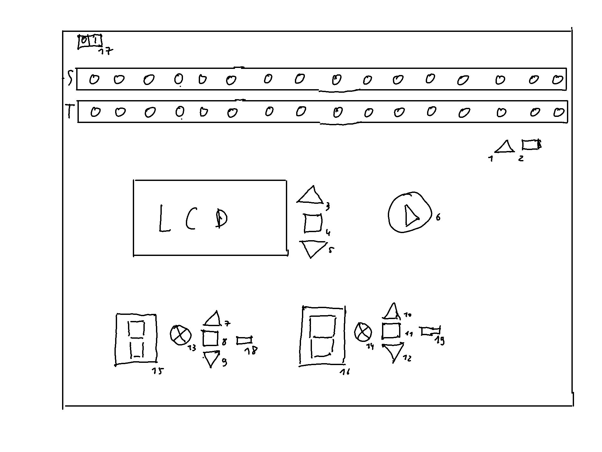
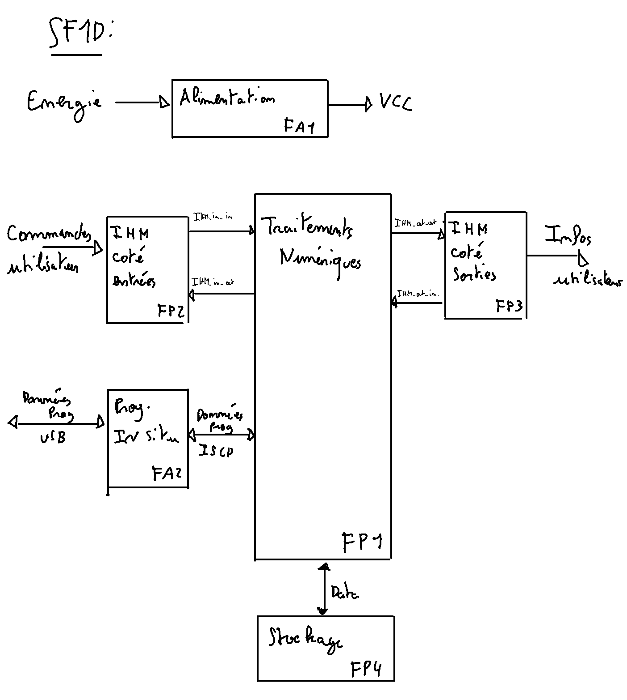

# Cahier des charges
Le cahier des charges est découpé en 3 parties, classées par ordre de priorité.

## Partie 1
Dans un premier temps, le système conçu doit être capable de :
- exécuter un programme prédéfini (codé en dur dans le programme microcontrôleur)
- avoir un mode pas à pas pour l'exécution du programme
- avoir un mode continu pour l'exécution du programme
- gérer l'affichage de l'état du ruban
- gérer l'affichage de la position de la tête de lecture
- gérer l'affichage de la table de transition

## Partie 2
Dans un second temps, on doit rajouter :
- la possibilité de choisir un programme via un menu
- le stockage des programmes à sélectionner
- l'initialisation manuelle du ruban et de la position de la tête de lecture

## Partie 3
Dans un troisième temps, on doit rajouter :
- la programmation d'une table de transition
- l'enregistrement de la table de transition programmée dans le support de stockage
- un reset de la programmation de la ligne en cours
- l'affichage d'une description du programme

L'objectif est de réaliser les trois parties, mais si le temps nous manque, on pourra décider de laisser tomber la partie 3, puis la partie 2 si nécessaire.

# Fonctionnement de la machine de turing
## Alimentation
La machine de turing est alimentée en 5V.

## Démarrage de la machine
La machine de turing est démarrée à l'aide d'un bouton on/off.

## Affichage des symboles
Les symboles sont représentés par un ruban de leds adressables. Chaque couleur prise par une led représente un symbole.

## Affichage de la tête de lecture
La tête de lecture est représentée par un ruban de leds adressables. La couleur de la led allumée représente la position de la tête de lecture.

## Stockage des programmes
Les programmes seront stockés sur une carte micro-sd. Les fichiers représentant les tables de transition auront un format précis à définir (csv séparé par des ";" ?).

## Navigation dans le menu
On a 3 boutons permettant de naviguer dans le menu. Le bouton haut permet de monter dans le menu, le bouton bas de descendre dans le menu et le bouton milieu de valider le choix.
Le menu s'affiche sur un écran LCD.
Le menu se présente de la manière suivante :
- choix de l'action à effectuer :
  - créer un programme
    - activation de la partie programmation
  - lancer un programme
    - choix du programme à lancer

## Programmation d'une table de transition
Une table de transition peut-être programmée. L'idée est qu'on a 2 afficheurs 7 segments permettant d'afficher l'état courant et l'état futur de la têtre de lecture. Cet état se choisit via des bouttons qui marchent de la manière suivante :
- partie courante :
  - bouton haut : incrémente l'état courant
  - bouton bas : décrémente l'état courant
  - bouton milieu : valide l'état courant
  - Une fois l'état courant validé, on choisit le symbole, représenté par une led, à l'aide des mêmes boutons.
- partie future :
  - bouton haut : incrémente l'état futur
  - bouton bas : décrémente l'état futur
  - bouton milieu : valide l'état futur
  - Une fois l'état futur validé, on choisit le déplacement de la tête de lecture à l'aide des mêmes boutons. 0 pour gauche, 1 pour droite.
  - Une fois le déplacement de la tête de lecture validé, on choisit le symbole à écrire à l'aide des mêmes boutons.
Une fois la table de transition programmée, on peut la valider à l'aide d'un bouton. Le programme est alors stocké sur la carte micro-sd, et devient visible dans le menu.

## Lancement d'un programme
On choisit le programme à lancer à l'aide des boutons haut et bas. On le valide à l'aide du bouton milieu. On entre alors en phase d'initialisation.
Lors de l'initialisation, le ruban de led s'allume dans la couleur du symbole par défaut. Deux boutons permettent alors de choisir, led par led, le symbole désiré, et de valider ce symbole pour passer à la led d'après.
Lorsque l'on appuie sur le bouton de démarrage du programme, le programme se lance.

# Schéma de la machine

### Légende du schéma
- S : Ruban de leds représentant les symboles
- T : Ruban de leds représentant la tête de lecture
- 1 : bouton de changement du symbole lors de la phase d'initialisation
- 2 : bouton de validation du symbole lors de la phase d'initialisation
- 3 : bouton haut du menu
- 4 : bouton de validation du choix du menu
- 5 : bouton bas du menu
- 6 : bouton de démarrage du programme
- 7 : bouton haut de la partie "courante" de la programmation
- 8 : bouton de validation de la partie "courante" de la programmation
- 9 : bouton bas de la partie "courante" de la programmation
- 10 : bouton haut de la partie "future" de la programmation
- 11 : bouton de validation de la partie "future" de la programmation
- 12 : bouton bas de la partie "future" de la programmation
- 13 : LED représentant l'état courant du symbole lors de la programmation
- 14 : LED représentant l'état futur du symbole lors de la programmation
- 15 : afficheur 7 segments représentant l'état courant de la tête de lecture lors de la programmation
- 16 : afficheur 7 segments représentant l'état futur de la tête de lecture lors de la programmation
- 17 : bouton on/off
- 18 : bouton de réinitialisation de la programmation de la ligne en cours de l'état actuel
- 19 : bouton de réinitialisation de la programmation de la ligne en cours de l'état futur

# Composants
- 2 rubans de leds adressables
- 2 afficheur 7 segments
- 14 boutons-poussoirs
- 1 interrupteur
- 1 lecteur de carte SD
- 1 écran LCD
- 1 microcontroleur

## Choix des composants
- Les rubans de leds adressables pressentis pour ce projet sont des rubans de leds [WS2812B](https://www.superlightingled.com/4mm-ws2812c-strip-light-328ft1m-individually-addressable-2020-rgb-led-p-3742.html) ou [SK9822](https://www.superlightingled.com/sk9822similar-to-apa102-rgb-144ledsm-dc5v-12mmwide-digital-intelligent-addressable-led-strip-lights-1m328ft-per-roll-p-2458.html).
- L'écran LCD pressenti est un [Hitachi HD44780](https://www.sparkfun.com/datasheets/LCD/HD44780.pdf).

# SF1D
Voici le SF1D de la machine de turing.

